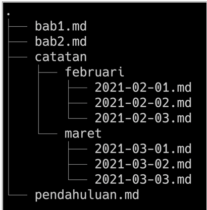
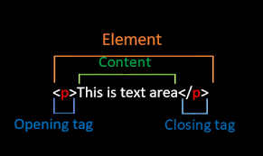
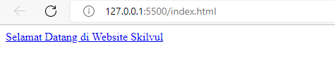
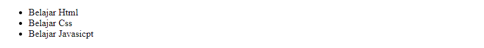
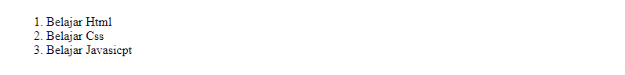

# <center style="background-color:tomato;">**Writing & Presentation Week 1**

## **Unix Comand Line**<hr>

- ### **Command Line Interface (CLI)** 
  <div align="justify">Command Line Interface adalah metode yang digunakan oleh pengguna untuk memasukkan perintah yang digunakan untuk menjalankan program, mengelola file komputer, dan berinteraksi dengan komputer.

- ### **Shell**
  <div align="justify">Shell adalah Sebuah program (command interpreter) yang menghubungkan pengguna dengan sistem operasi. Ketika pengguna memasukkan perintah, itu diteruskan ke sistem untuk dieksekusi.

- ### **Struktur File System**
  <div align="justify">Sebuah filesystem mengatur bagaimana data disimpan di dalam sebuah system
  . Sistem operasi di Windows & Unix-like menyusun file dan direktori menggunakan struktur yang bentuknya mirip tree
  <br>Contoh gambar :<br>
  

- ### **Command**
  - Command “pwd” (print working directory) untuk  melihat nama direktori kita berada saat ini.
  - Command “ls” (lists) untuk melihat isi dari direktori
  - Command “cd”  (change directory) untuk pindah ke
  direktori lain
  - Command “head”, “tail”, dan “cat” untuk isi files di awal, akhir, dan keseluruhan.
  - Command “touch” untuk membuat file
  - Command “mkdir”  untuk membuat directory
  - Command “cp” untuk menyalin file, “cp -R” untuk menyalin directory
  - Command “mv” untuk memindahkan file, “mv -R” untuk memindahkan directory
  - Command “rm” untuk menghapus file, “rm -R” atau “rm -d” untuk menghapus directory


## **Git & Github Dasar**<hr>

- ### **Pengertian Git & Github**
  - #### **Git**
    <div align="justify">Git adalah aplikasi yang digunakan untuk melacak setiap perubahan yang terjadi pada suatu folder atau file. Git biasanya digunakan oleh para programmer sebagai tempat penyimpanan file pemrograman mereka, karena lebih efektif. File -file yg disimpan menggunakan git akan terlacak seluruh perubahannya, termasuk siapa yang mengubah.

  - #### **Github**
    <div align="justify">GitHub merupakan layanan cloud berbasis website yang berguna untuk menyimpan dan mengelola sebuah project menggunakan repository (repo git). 

- ### **Mengapa harus menggunakan GIT dan Github?**
  <div align="justify">Dengan menggunakan GIT dan Github, tujuannya yaitu untuk memudahkan programmer dalam melakukan kolaborasi mengerjakan proyek yang sama tanpa harus repot copy paste folder aplikasi yang terupdate. kita juga tidak perlu menunggu rekan dalam satu tim menyelesaikan suatu program dahulu untuk berkolaborasi. karena kita dapat membuat file didalam projek yang sama atau membuat code di file yang sama dan menyatukannya saat sudah selesai.

- ### **Perintah menggunakan git & github**
  - #### **git init**
    Perintah ini digunakan untuk membuat repositori baru.
    
  - #### **git branch**
    perintah untuk melihat semua cabang di repository GIT checkout: sebuah perintah yang digunakan untuk menukar branch yang aktif dengan bracht yang sudah dipilih. GIT merge: perintah yang digunakan untuk menggabungkan cabang aktif serta cabang yang dipilih
    
  - #### **git add**
    Perintah git add bisa digunakan untuk menambahkan file.
    
  - #### **git commit**
    Perintah git commit digunakan untuk melakukan commit atau menyimpan perubahan pada version control pada git.
    
  - #### **git remote**
    Perintah git remote akan membuat user terhubung ke remote repository.
    
  - #### **git push**
    git push adalah perintah untuk mengirimkan perubahan ke master branch dari remote repository.
    

## **Html**<hr>
- ### **Pengertian & Fungsi Html**
  <div align="justify">HTML (Hypertext Markup Language) adalah bahasa markup yang digunakan untuk membuat halaman website. Isinya terdiri dari berbagai kode yang dapat menyusun struktur suatu website. HTML sendiri digunakan untuk menampilkan konten pada browser. Contoh konten yang dapat ditampilkan seperti Text, Image, Video, Link, dan masih banyak lainnya.
- ### **Tools Yang Diperlukan Membuat Html**
  - #### **Browser**
    <div align="justify">Ada banyak Browser yang bisa digunakan. Paling recommended bisa menggunakan Google Crome.
  - #### **Code Editor**
    <div align="justify">Direkomendasikan menggunakan Visual Studio Code karena bisa digunakan untuk banyak bahasa pemrograman dan banyak extension yang tersedia.
  - #### **Extension Visual Studio Code**
    - **Live Server**
      <div align="justify">Live server merupakan extensi yang dapat secara otomatis menampilkan perubahan web ketika kita melakukan perubahan pada code html atau pun css.
    - **Prettier**
      <div align="justify">prettier dapat secara otomatis merapikan dan memformat kode sehingga mudah untuk dibaca dan terlihat rapi.
    - **Auto Rename Tag**
      <div align="justify">Auto Rename Tag akan secara otomatis  menganti tag apabila salah satu tag pembuka atau tag penutup diubah.
    - **Auto Close Tag**
      <div align="justify">Ekstensi untuk menambahkan penutup tag secara otomatis pada HTML.
- ### **Struktur Html**
  ```html
  <!DOCTYPE html>
  <html lang="en">
  <head>
      <meta charset="UTF-8">
      <meta http-equiv="X-UA-Compatible" content="IE=edge">
      <meta name="viewport" content="width=A, initial-scale=1.0">
      <title>Belajar Html</title>
  </head>
  <body>
      Ayo belajar Html di Skivul
  </body>
  </html>
  ```
- ### **Html Anotomy**
  

  - HTML Element adalah semua komponen yang menyusun dokumen HTML.
  - Opening Tag (tag pembuka) - contohnya adalah `<p>`.
  - Closing Tag (tag penutup) - contohnya adalah `</p>`.
  - Attribute - contohnya adalah style yang memiliki Value.  
    ```html
    <p style="color: red;">Belajar Bersama Skilvul</p>
    ```
  - Content (konten) yang ingin ditampilkan di browser - contohnya adalah ```Belajar Bersama skilvul```.

- ### **Html Comment**
   ```html
   <!-- ini adalah syntax comment html -->
   <p style="color: red;">Belajar Bersama Skilvul</p> 
   ```
   <div align="justify">Dengan menggunakan HTML Comment, kita dapat memberikan penjelasan maksud dari line code yang kita kerjakan atau bisa digunakan untuk mematikan code.
- ### **HTML Tag**
  - #### **Tag untuk membuat link**
    ``` html
    <a href="https://skilvul.com/">Selamat Datang di Website Skilvul</a>
    ```
    Hasil di Web Browser:
    
  - #### **Tag untuk membuat daftar list**
    - Unodered List
      ```html
      <!-- Unordered List -->
      <ul>
        <li>Belajar Html</li>
        <li>Belajar Css</li>
        <li>Belajar Javasicpt</li>
      </ul>
      ```
      Hasil di Web Browser:
      
    - Ordered List
      ```html
      <!-- Ordered List -->
      <ol>
        <li>Kucing</li>
        <li>Anjing</li>
        <li>Ikan</li>
      </ol>
      ```
      Hasil di Web Browser:
      
  - #### **Tag untuk membuat daftar list**
    ```html
    
    ```
    Hasil di Web Browser:
    
- ### **Semantic Html**
  <div align="justify">Semantic HTML yaitu menggunakan elemen HTML sesuai dengan kebutuhan konten. Contoh yaitu header, footer, nav, section, aside, dll.

  ```html
  <body>

  <header>
    <h1>My Blog</h1>
  </header>

  <nav>
    <a href="#">Home</a> |
    <a href="#">About</a> |
    <a href="#">Contact</a>
  </nav>

  <article>
    <h1>Welcome To My Blog!</h1>
    <p>Perkenalkan nama saya Rohmad Krisna. Biasa dipanggil krizz. Saat ini aku tenggah mengikuti Studi Independen Program Skilvul Tech4Impact: Back-end Web Development. 
    </p>
  </article>

  <footer>
    Copyright &copy; 2022 by Rohmad Krisna
  </footer>

  </body>
  ```

- ### **Mempublish Website**

## **Css**<hr>
- ### **Pengertian & Fungsi Css**
  <div align="justify">CSS adalah bahasa yang digunakan untuk mendesain halaman website.Dengan CSS, kita bisa mengubah warna, menggunakan font custom, editing text format, mengatur tata letak, dan lainnya.

- ### **Cara Penggunaan Css**
  - #### **Inline CSS**
    <div align="justify">
    Inline CSS adalah cara kita memberikan attribute style kepada sebuah element dengan menyisipkannya langsung di dalam element HTML tersebut.

    ```css
    <!DOCTYPE html>
    <html>
      <head>
        <title>
          Selamat Datang
        </title>
      </head>
      <body>
        <h1 style="color:blue;">Belajar Css Dasar</h1>
      </body>
    </html>
    ```
  - #### **Internal CSS**
    <div align="justify">

    Kita menggunakan element/tag `<style>` untuk menyisipkan kode CSS. element/tag `<style>` diletakkan di dalam element `<head>`.

    ```css
    !DOCTYPE html>
    <html>
      <head>
        <title>Selamat Datang</title>
        <style>
          body {
            background-color: yellow;
          }
          h1 {
            color: blue;
          }
          p {
            color: red;
          }
        </style>
      </head>
      <body>
        <h1>Website Pertamaku</h1>
        <p>Saya Akan Succes</p>
      </body>
    </html>
    ```
  
  - #### **External CSS**
    <div align="justify">

    External CSS adalah cara menyisipkan kode CSS dengan cara membuat file CSS terpisah, dan lalu menyambungkannya dengan file HTML dengan menggunakan element `<link>`. Element `<link>` tersebut diletakkan di dalam element `<head>`.

    Contoh:
    memiliki dua file: index.html untuk file HTML-nya dan styles.css untuk file CSS-nya.

    ```css
    <!-- File index.html -->
    <!DOCTYPE html>
    <html>
      <head>
        <title>Selamat Datang</title>
        <link rel="stylesheet" href="styles.css" />
      </head>
      <body>
        <h1>Website Pertamaku</h1>
        <p>Saya Masih Pemula</p>
      </body>
    </html>
    ```
    ```css
    /* File styles.css */
    body {
      background-color: pink;
    }
    h1 {
      color: blue;
    }
    p {
      color: black;
    }
    ```
- ### **Css Syntax**
  <div align="justify">
  
  CSS Syntax adalah syntax yang digunakan untuk menunjuk atau memilih HTML element mana yang ingin diberi style (dihias). CSS syntax terdiri dari selector, property, dan value. Contohnya kita memiliki element heading satu `<h1>` yang ingin kita ubah menjadi warna merah.
  ```css
  h1 {
    color: blue;
  }
  ```
- ### **Access file .css**
  ```html
  <!-- Jika file css sejajar dengan file Html -->
  <link rel="stylesheet" type="text/css" href="style.css"> 
  <!-- Jika file css berada didalam folder yang sejajar dengan file Html -->
  <link rel="stylesheet" type="text/css" href="css/style.css">
  <!-- Jika Html berada didalam folder, Css sejajar dengan folder Html -->
  <link rel="stylesheet" type="text/css" href="../style.css">
  ```
- ### **CSS - Tag Name**
  <div align="justify">Kita bisa menggunakan Tag Elemen HTML secara langsung pada CSS.Jika menggunakan Tag Element, maka ini bersifat global.

  ```html
  <!-- File Html -->
  <body>
  <div>
    <h1>Selamat Datang Di Blog Saya</h1>
    <P>Saya Akan Succes</P>
  </div>
  <div>
    <h1>My Profile</h1>
    <ol>
      <li>Nama : Rohmad Krisna</li>
      <li>Umur : 21 Tahun</li>
      <li>Kampus : Universitas Merdeka Madiun</li>
      <li>Alamat : Madiun, Jawa Timur</li>
    </ol>
  </div>
  <div>My Gallery</div>
    
  </body>
  </html>
  ```

  ```css
  <!-- File Css -->
  h1 {
    color : aqua;
  }
  ```

  Dari contoh gambar diatas Tag Element `<h1>` yang ada di file Html akan ikut berubah semua.

- ### **CSS Class Name**
  <div align="justify">
  Cara menggunakan attribute class pada elemen HTML yaitu dengan cara memanggil nama class tersebut pada file CSS

  ```html
  <!-- File Html -->
  <h1 class="title">My Profile</h1>
  ```

  ```css
  <!-- File Css -->
  .title {
    color : aqua;
  }
  ```
- ### **CSS - ID Name**
  <div align="justify">
  Berbeda dengan Class Name. ID Name bersifat unik artinya hanya ada 1 nama ID pada 1 element HTML.

  ```html
  <!-- File Html -->
  <p id="paragrafSatu">Namaku Krizz</p>
  ```
  ```css
  <!-- File Css -->
  #paragrafSatu {
    border: solid red;
  }
  ```

- ### **Flexbox**
  <div align="justify">Flexbox memudahkan para programmer untuk mengatur layout, posisi, dan ukuran dari tiap element di dalamnya.Ada dua istilah penting saat belajar flexbox:

  - *container* adalah element yang membungkus dan mengatur tampilan dari element di dalamnya.
  - *item* adalah element dalam container yang diatur tampilannya.<hr>
  - **Justify - content** digunakan untuk mengatur tata letak antar item child secara horizontal.
  - **Align - content** digunakan untuk mengatur tata letak antar item child secara vertikal atau cross axis.
  - **Flex-grow** digunakan untuk mengatur size suatu item child pada flexbox.
  - **Flex-shrink** digunakan untuk memperkecil size suatu item child secara relatif terhadap item child lainnya.
  - **Flex-basis** digunakan untuk mengatur width setiap item child.

- ### **Hasil Belajar Styling Css**  
  

## **Algorithm and Pseudocode**<hr>
1. __Algoritma__ merupakan deskripsi berupa step-step yang dibutuhkan untuk menyelesaikan suatu masalah. __Data Structure__ merupakan cara menyimpan dan mengelola data di dalam komputer.

2. Manfaat penggunaan algortima dan data structur adalah karena algoritma dapat membantu manyusun langkah - langkah untuk menyelesaikan suatu masalah. Dan data structur ini adalah programming yang digunakan untuk mengelola/manajemen sebuah data yang telah disusun secara algoritma tadi.
3. Algoritma sederhana dalam bahasa pemrograman javascript.
    ```javascript
        let angka = 2;
        let hasil;

        hasil = angka * 5;
        console.log(hasil);
    ```

4. __Big O__ sebuah cara atau metode untuk melakukan analisa terhadap sebuah algoritma pemrograman terhadap waktu eksekusi. Mencari jalan alternatif untuk mempermudah lagi jalan nya program yang semakin besar di waktu kedepan.

5. Jika ada data untuk mengeluarkan pesan banyak misal 100 output pesan dan membutuhkan waktu atau tenaga yang lebih, jadi penggunaan looping adalah solusi yang bagus.

6. Penerapan struktur data __Array__ dengan javascript.
    ```javascript
        let nama = ["rifaldo", "reza", "saputra"];
        let a;

        for(a = 2; 0 <= a; a--){
        console.log("aku adalah " + nama[a]);
        }
    ```

# JavaScript Dasar Introduction
1. __JavaScript__ merupakan bahasa pemrograman yang digunakan untuk membuat web menjadi lebih interaktif dan responsive.

2. Untuk menjalankan javascript pada umumnya menggunakan web browser seperti Chrome, Microsoft Edge, Mozila Firefox, kalau pakai code editor Visual Studio Code bisa di bagian console.

3. Macam - macam Tipe Data di JavaScript :
    - __Number__ : tipe data yang mengandung semua jenis angka. Tipe data number ada 2 macam yaitu integer (terdiri dari bilangan bulat positif atau negatif) dan float (terdiri dari bilangan desimal).
    - __String__ : tipe data yang terdiri dari huruf, angka, spasi maupun simbol Tipe data string.
    - __Boolean__ : tipe data yang memiliki nilai true or false.
    - __Null__ : tipe data pada sebuah data/variabel yang tidak memiliki nilai.
    - __Undefined__ : tipe data yang merepresentasikan varibel/data yang tidak memiliki nilai.
    - __Object__ : tipe data yg dapat berisi berbagai nilai dan berhubungan dengan dunia nyata.
4. Operator digunakan untuk menyimpan sebuah nilai pada variabel. __Contoh__ `` let saya = "Krizz"; `` jadi variabel data ``saya`` memiliki nilai string ``Krizz``. Dengan Operator Math perkalian ``*``
    ```javascript
        let angka = 6;
        let hasil = angka * 4;
        console.log(hasil); // 24    
    ```
5. __Conditional__ merupakan statement percabangan yang menggambarkan suatu kondisi, statement akan mengecek kondisi spesifik dan menjalankan perintah berdasarkan kondisi tersebut. Yang dicek adalah apakah kondisi tersebut TRUE (benar). Jika TRUE maka code didalam kondisi tersebut dijalankan. Kondisi tersebut bisa menggunakan ``IF, IF.. Else, IF.. Else if Statement``.
__Looping__ adalah statement yang mengulang atau perulangan sebuah instruksi hingga kondisi terpenuhi atau jika kondisi stop atau berhenti tercapai. Misal menggunakan perulangan ``For Loop`` contoh statement 
    ```JavaScript
        for(let a = 1; a <= 10; a++){
        console.log(a); // 1 2 3 4 5 6 7 8 9 10
        } 
    ```
    Jadi kode di atas saat ``a = 1`` lalu ``a kurang dari sama dengan(<=) 10)`` maka ``a +1 (a++)``. Lalu ditampilkan dengan ``console.log(a)``.<br>

# JavaScript Dasar Scope and Function

1. __Scope__ adalah konsep dalam flow data variabel, yang menentukan suatu variabel bisa diakses pada scope tertentu atau tidak, scope memiliki lingkup sifat global dan local. Kalau sifat global itu bisa lebih luas daripada local. 

2. __Function__  merupakan sebuah blok kode dalam sebuah grup untuk menyelesaikan 1 task/1 fitur. Saat kita membutuhkan fitur tersebut nantinya, kita bisa kembali menggunakannya. 
    ``` JavaScript
        function hasilLooping(){
            for(let a = 1; a <= 10; a++){
              console.log(a);
            }
        }
        
        hasilLooping(); // 1 2 3 4 5 6 7 8 9 10
    ``` 
    <br>
3. Hal pertama koreksi kode apakah ada yang salah, jika merasa tidak ada terus di run ada, jika ada eror maka kita baca dan pahami isi (dalam) pesan kesalahan yang muncul di konsol Anda (web browser, terminal, atau apa pun yang digunakan). Jenis - jenis kesalahan yang sering ditemui : <br>
     - Kesalahan referensi <br>
         &ensp; Merupakan hal yang umum ketika menggunakan const dan let, mereka diangkat seperti var dan function tetapi ada waktu antara pengangkatan dan dideklarasikan sehingga ketika mencoba mengaksesnya terjadi kesalahan referensi.
     - Kesalahan sintaks <br>
         &ensp; Kesalahan ini seperti mengirim tanda koma saat memanggil fungsi ditangani tanpa kesalahan oleh sebagian besar browser terbaru, tetapi yang lebih lama harus berhati-hati.
     - Kesalahan salah ketik <br>
         &ensp; Muncul ketika jenis (angka, string, dan sebagainya) yang digunakan atau akses tidak kompatibel, seperti mengakses properti dalam jenis variabel yang tidak ditentukan. Cara mengatasinya sederhana, pastikan bilah itu ada sebelum mencoba mengaksesnya, baik dengan membuat bilah atau dengan memeriksa _undefined_.

# JavaScript Dasar Data Type Built in Prototype & Method

1. __Data Type__ untuk dapat beroperasi pada variabel, penting untuk mengetahui sesuatu tentang tipenya yang diinputkan.
2. __String__ digunakan untuk mewakili data tekstual. Ini adalah satu set "elemen" dari nilai integer 16-bit unsigned. Setiap elemen dalam String menempati posisi dalam String.
3. __Number__ merupakan yang memiliki satu jenis angka, yang dapat ditulis dengan atau tanpa desimal. 
4. __Math__  memungkinkan untuk melakukan tugas matematika pada angka/number.
5. __Primitive__ sudah ditentukan sebelumnya di java, yang selalu memiliki nilai diawali huruf kecil dapat juga tergantung pada tipe data nya. __Non Primitive__ dibuat oleh programmer dan tidak didefinisikan oleh Java (kecuali untuk String), digunakan untuk memanggil method dan untuk melakukan operasi tertentu yang dapat berupa nilai ``null``.


# <br>
  
    


 


  
  


  

  

  


  


